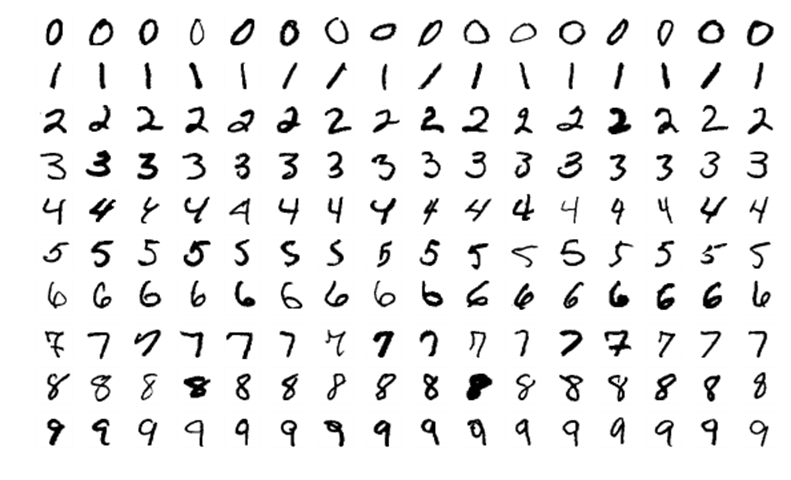
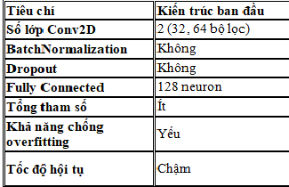
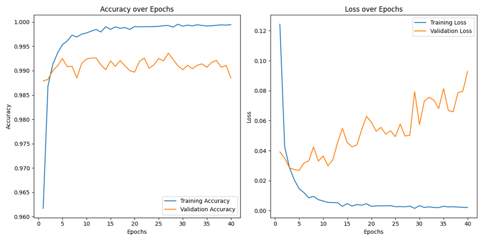
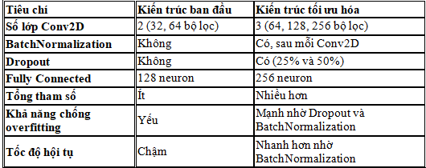
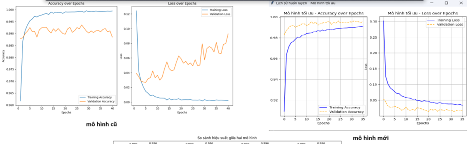

# Giới thiệu các công cụ sử dụng

Ngôn ngữ lập trình Python: Python là một ngôn ngữ lập trình cấp cao, đa năng và được biết đến với cú pháp đơn giản, dễ đọc, phù hợp cho cả người mới học lẫn các chuyên gia lập trình. Với khả năng hỗ trợ nhiều thư viện mạnh mẽ, Python trở thành lựa chọn hàng đầu trong lĩnh vực trí tuệ nhân tạo, học máy, xử lý dữ liệu, và phát triển ứng dụng.

Thư viện TensorFlow và Keras: Được sử dụng để xây dựng và nạp mô hình mạng neural tích chập (CNN) đã được huấn luyện trước đó . Keras cung cấp một giao diện lập trình cấp cao để xây dựng mô hình CNN dễ dàng hơn. 

NumPy: Thư viện tính toán khoa học được sử dụng để thao tác với các mảng dữ liệu, chẳng hạn như hình ảnh được đưa vào mô hình . 

Tkinter: Thư viện đồ họa của Python được sử dụng để tạo giao diện người dùng (GUI) cho ứng dụng . Tkinter cung cấp các widget như canvas, nút và nhãn để người dùng tương tác với chương trình. 

Pillow (PIL Fork): Thư viện xử lý hình ảnh của Python được sử dụng để thao tác với ảnh do người dùng vẽ trên canvas. PIL cung cấp các hàm để tạo, mở, lưu và xử lý ảnh.

DATASET:[Trang tải](https://yann.lecun.com/exdb/mnist/).

mô hình giúp cho người dùng nhận dạnh hình ảnh chữ số viết tay và thực hiện nhận dạng chính xác chữ số từ 0 đến 9. Kết quả dự đoán cần được hiển thị rõ ràng và dự đoán chữ số một cách tốt để có thể dùng trên giao diện người dùng xây dựng. mô hình cần đảm bảo thời gian xử lý nhanh, đáp ứng nhu cầu sử dụng thực tế(bước đầu là cho phép người dùng làm quen với học sâu của xử lý ảnh).

# Lựa chọn bộ dữ liệu 
Bộ dữ liệu được sử dụng trong đề tài là: MNIST 
Bộ dữ liệu MNIST (Modified National Institute of Standards and Technology) là một tập dữ liệu chuẩn trong lĩnh vực trí tuệ nhân tạo, đặc biệt trong bài toán nhận dạng chữ số viết tay. MNIST bao gồm 70.000 hình ảnh chữ số viết tay từ 0 đến 9, trong đó có 60.000 hình ảnh dùng để huấn luyện và 10.000 hình ảnh để kiểm tra. Mỗi hình ảnh trong bộ dữ liệu có kích thước 28x28 pixel và là ảnh xám (grayscale), giúp giảm độ phức tạp của bài toán và tăng tính đồng nhất của dữ liệu . Đặc biệt, các chữ số trong MNIST được viết bởi nhiều người khác nhau, bao gồm cả trẻ em và người lớn, tạo nên sự đa dạng trong phong cách viết và độ phức tạp, làm cho nó trở thành một bộ dữ liệu lý tưởng để kiểm tra độ mạnh mẽ của các mô hình nhận diện.

Trong nhận dạng chữ viết tay, MNIST đóng vai trò là bộ dữ liệu khởi điểm để phát triển và kiểm thử các thuật toán xử lý ảnh và học sâu . Bộ dữ liệu này thường được sử dụng để huấn luyện các mô hình Machine Learning hoặc Deep Learning, đặc biệt là mạng nơ-ron tích chập (Convolutional Neural Networks - CNN). Nhờ tính chuẩn hóa cao và dễ sử dụng, MNIST không chỉ giúp các nhà nghiên cứu kiểm chứng hiệu quả của mô hình mà còn hỗ trợ trong việc so sánh hiệu suất giữa các thuật toán . Ngoài ra, MNIST còn được dùng làm tài liệu học tập cho người mới bắt đầu nghiên cứu về trí tuệ nhân tạo, giúp họ hiểu rõ hơn về quy trình xử lý dữ liệu, huấn luyện mô hình và đánh giá kết quả.

Ứng dụng thực tiễn của MNIST chủ yếu nằm trong việc xây dựng nền tảng cho các hệ thống nhận diện chữ viết tay, chẳng hạn như xử lý tài liệu hành chính, nhận diện séc hoặc hóa đơn trong ngân hàng, và số hóa văn bản viết tay . Bộ dữ liệu này không chỉ hỗ trợ việc phát triển các hệ thống nhỏ mà còn là bước khởi đầu cho các nghiên cứu mở rộng với dữ liệu lớn và phức tạp hơn, chẳng hạn như nhận diện chữ viết tay toàn phần hoặc các ký tự không phải tiếng Anh.

Bộ dữ liệu MNIST chứa hình ảnh thang độ xám của chữ số viết tay, cung cấp một bộ dữ liệu có cấu trúc tốt cho các tác vụ phân loại hình ảnh. Dưới đây là một ví dụ về hình ảnh từ bộ dữ liệu:

**Hình 1:** Các mẫu chữ số viết tay từ tập dữ liệu MNIST.  

### Mô tả hình ảnh:
Hình ảnh là các chữ số viết tay từ bộ dữ liệu MNIST, với mỗi ô vuông đại diện cho một mẫu chữ số. Có tổng cộng 10 hàng, mỗi hàng tương ứng với một chữ số từ 0 đến 9. Mỗi chữ số được viết theo nhiều cách khác nhau, thể hiện sự đa dạng về kiểu dáng, độ nghiêng, và nét viết tay.

### Chú thích chi tiết:
- **Hàng 1:** Chữ số 0, hiển thị nhiều kiểu viết tay khác nhau, từ nét tròn đến nét góc cạnh.
- **Hàng 2:** Chữ số 1, với các nét thẳng đứng, nghiêng hoặc hơi cong.
- **Hàng 3:** Chữ số 2, thể hiện các cách viết từ nét mượt đến nét góc cạnh.
- **Hàng 4:** Chữ số 3, với các vòng tròn trên và dưới được viết ở nhiều dạng.
- **Hàng 5:** Chữ số 4, có kiểu nét đứng thẳng hoặc nghiêng.
- **Hàng 6:** Chữ số 5, với nét gấp khúc hoặc đường cong mềm mại.
- **Hàng 7:** Chữ số 6, hiển thị các dạng cong tròn rõ ràng.
- **Hàng 8:** Chữ số 7, với nét ngang trên cùng và nét nghiêng đi xuống.
- **Hàng 9:** Chữ số 8, hiển thị các dạng viết tay với hai vòng tròn đều nhau hoặc không đều.
- **Hàng 10:** Chữ số 9, có nét trên tròn và nét dưới thẳng hoặc cong.

# Mô tả khái quát về mô hình “MnistCNN” mô hình cơ bản ban đầu
### 1. Tổng quan về nhiệm vụ
Mô hình này được xây dựng để nhận diện chữ số viết tay từ tập dữ liệu MNIST. Đây là một bài toán phân loại, trong đó mỗi ảnh chữ số viết tay (28x28 pixel) được phân loại thành một trong 10 lớp tương ứng với các chữ số từ 0 đến 9.
### 2. Xử lý dữ liệu
•	Dữ liệu đầu vào:

o	Ảnh chữ số: Mỗi ảnh có kích thước 28x28 pixel, được chuẩn hóa về giá trị từ [0, 255] thành [0.0, 1.0] để tăng hiệu quả huấn luyện.

o	Nhãn chữ số: Tập nhãn dạng số nguyên từ 0 đến 9, dùng để xác định đúng chữ số của mỗi ảnh.

•	Tệp dữ liệu:

o	Ảnh và nhãn được tải từ các tệp .gz và xử lý thành các mảng NumPy.

### 3. Kiến trúc của mô hình MnistCNN
Mô hình được thiết kế dựa trên mạng nơ-ron tích chập (Convolutional Neural Network - CNN) với các thành phần chính như sau:

**1**.	Input Layer:

o	Kích thước đầu vào: (28, 28, 1) (ảnh xám có 1 kênh màu).

**2**.	Convolutional Layers (Tích chập):

o	Lớp tích chập 1: 32 bộ lọc kích thước (3x3), hàm kích hoạt ReLU.

o	Lớp pooling 1: Giảm kích thước với max pooling kích thước (2x2).

o	Lớp tích chập 2: 64 bộ lọc kích thước (3x3), hàm kích hoạt ReLU.

o	Lớp pooling 2: Max pooling (2x2).

**3**.	Flatten Layer (Phẳng hóa):

o	Chuyển tensor 2D thành vector 1D để kết nối với lớp fully connected.

**4**.	Dense Layers (Kết nối đầy đủ):

o	Lớp ẩn: 128 nơ-ron với hàm kích hoạt ReLU.

o	Lớp đầu ra: 10 nơ-ron, mỗi nơ-ron tương ứng với một lớp chữ số, sử dụng hàm kích hoạt softmax để dự đoán xác suất.

**4**. Huấn luyện và đánh giá

•	Biên dịch mô hình:

o	Hàm mất mát: sparse_categorical_crossentropy (phù hợp cho bài toán phân loại đa lớp).

o	Tối ưu hóa: adam (tăng tốc hội tụ và hiệu quả tối ưu hóa).

o	Đánh giá: Sử dụng độ chính xác (accuracy).

•	Huấn luyện mô hình:

o	Số epoch: 20.

o	Dữ liệu huấn luyện: Tập train_images và train_labels.

o	Dữ liệu kiểm tra: Tập test_images và test_labels.

•	Đánh giá mô hình:

o	Sau khi huấn luyện, mô hình được đánh giá trên tập kiểm tra để tính toán:

	Loss (Hàm mất mát).

	Accuracy (Độ chính xác).

**5**. Kết quả cuối cùng

•	Lưu mô hình: Mô hình sau khi huấn luyện được lưu dưới tên file MnistCNN.keras để sử dụng trong tương lai.

•	Độ chính xác: Được in ra sau khi đánh giá trên tập kiểm tra (test_images và test_labels).

**Hình 2:** mô tả mô hình ban đầu

tuy nhiên với cách xây dụng cơ bản như vậy thi mô hình có khả năng gặp phải một sô tình trạng lỗi ở đây có thể nói tói như hình dưới

**Hình 3:** đánh giá mô hình ban đầu

### giải thích:

**Accuracy over Epochs (Biểu đồ bên trái):**

o	Độ chính xác trên tập huấn luyện (Training Accuracy) tăng dần và đạt gần 100%, cho thấy mô hình học tốt trên dữ liệu huấn luyện.

o	Độ chính xác trên tập kiểm tra (Validation Accuracy) ổn định quanh mức 99%, nhưng không tăng thêm nhiều sau một số epoch đầu. Điều này cho thấy mô hình có khả năng tổng quát hóa tốt nhưng có thể đã đạt giới hạn về độ chính xác.

**Loss over Epochs (Biểu đồ bên phải):**

o	Hàm mất mát trên tập huấn luyện (Training Loss) giảm đều và duy trì ở mức thấp, cho thấy mô hình tối ưu tốt trên dữ liệu huấn luyện.

o	Hàm mất mát trên tập kiểm tra (Validation Loss) giảm ban đầu nhưng tăng dần sau khoảng 10 epoch, biểu hiện của hiện tượng overfitting (mô hình học quá mức dữ liệu huấn luyện).

**Nhận xét**:

•	Mô hình hoạt động tốt với độ chính xác cao, nhưng có dấu hiệu overfitting, vì Validation Loss tăng trong khi Validation Accuracy không cải thiện.

sau khi cải thiện ta được mô hình thứ 2 đã cải thiện được tình trạng overfitting trên.

#  Mô tả khái quát về mô hình “OptimizationMnistCNN” mô hình sau khi cải thiện

**Hình 4:** so sánh 2 mô hình trước sau cải thiện

### 1. Kiến trúc của mô hình OptimizationMnistCNN

Mô hình “OptimizationMnistCNN” là một phiên bản cải tiến của mạng nơ-ron tích chập (CNN) để nhận diện chữ viết tay từ tập dữ liệu MNIST. So với mô hình cũ mô hình này mạnh mẽ với các kỹ thuật nâng cao nhằm cải thiện hiệu năng và giảm overfitting. Dưới đây là khái quát về mô hình:

**1**.	Dữ liệu đầu vào:

o	Tập dữ liệu MNIST (chữ số viết tay) gồm các ảnh 28x28, được chuẩn hóa về khoảng [0, 1].

o	Sử dụng kỹ thuật Data Augmentation để tăng tính đa dạng của dữ liệu huấn luyện, bao gồm xoay, dịch chuyển, và zoom ảnh.

**2**.	Cấu trúc mô hình:

o	Lớp tích chập (Conv2D):

	3 lớp tích chập với số lượng bộ lọc tăng dần (64, 128, 256).

	Kích thước kernel là (3, 3) và hàm kích hoạt ReLU.

o	Batch Normalization: Được thêm sau mỗi lớp tích chập để tăng tốc độ huấn luyện và cải thiện độ ổn định.

o	MaxPooling2D: Giảm kích thước không gian của đặc trưng bằng cách lấy giá trị cực đại trong mỗi vùng pooling (2x2).

o	Dropout: Được sử dụng ở mức 0.25 và 0.5 để giảm overfitting.

o	Flatten và Dense:

	Lớp Flatten chuyển tensor thành vector để kết nối với các lớp fully connected.

	Một lớp Dense 256 nút với ReLU, và lớp đầu ra với 10 nút (softmax) tương ứng với 10 chữ số.

**3**.	Kỹ thuật tối ưu:

o	Optimizer: Sử dụng Adam để tối ưu hóa với tốc độ hội tụ nhanh.

o	Loss Function: sparse_categorical_crossentropy phù hợp cho bài toán phân loại nhiều lớp.

o	EarlyStopping: Theo dõi val_loss và dừng huấn luyện sớm nếu không cải thiện trong 15 epoch, tránh lãng phí tài nguyên.

**4**.	Huấn luyện và đánh giá:

o	Dữ liệu được huấn luyện qua ImageDataGenerator để áp dụng augmentation trong thời gian thực.

o	Mô hình được huấn luyện trong tối đa 40 epoch, với dữ liệu kiểm tra (validation) để đánh giá khả năng tổng quát hóa.

o	Mô hình đạt được hiệu suất tốt và được lưu lại dưới tên updateMnistCNN.keras.

#### 2. Tóm tắt ưu điểm so với mô hình ban đầu:

•	Mô hình kết hợp Data Augmentation, Dropout, và Batch Normalization để cải thiện độ chính xác và giảm overfitting.

•	EarlyStopping giúp tối ưu hóa thời gian huấn luyện và lựa chọn mô hình tốt nhất.

•	Sử dụng cấu trúc CNN đa tầng, mạnh mẽ và phù hợp cho dữ liệu hình ảnh.

**Hình 5:** đánh giắ so sánh 2 mô hình trước sau cải thiện

#### giải thích:

**Mô hình cũ:**

•	Accuracy over Epochs (Độ chính xác qua các Epochs):
Độ chính xác của mô hình huấn luyện (Training Accuracy) đạt gần 100%, trong khi độ chính xác trên tập kiểm tra (Validation Accuracy) chỉ đạt khoảng 99%. Tuy nhiên, độ chính xác trên tập kiểm tra không cải thiện nhiều sau vài epoch đầu, cho thấy mô hình đã đạt giới hạn của nó.

•	Loss over Epochs (Hàm mất mát qua các Epochs):
Hàm mất mát trên tập huấn luyện (Training Loss) giảm xuống nhanh chóng và duy trì ở mức thấp, cho thấy mô hình đang học tốt trên dữ liệu huấn luyện. Tuy nhiên, hàm mất mát trên tập kiểm tra (Validation Loss) bắt đầu tăng sau khoảng 10 epoch, dấu hiệu của hiện tượng overfitting (mô hình học quá mức dữ liệu huấn luyện).

**Mô hình mới:**

•	Accuracy over Epochs:
Độ chính xác trên tập huấn luyện và tập kiểm tra của mô hình mới đều đạt mức cao và duy trì ổn định. Đặc biệt, độ chính xác trên tập kiểm tra có sự cải thiện rõ rệt và ổn định, cho thấy mô hình đã khắc phục được vấn đề overfitting.

•	Loss over Epochs:
Hàm mất mát trên tập kiểm tra giảm đều và ổn định, không tăng lên như trong mô hình cũ, chứng tỏ mô hình mới hoạt động ổn định và không bị overfitting.

**Tổng kết:**

•	Mô hình cũ có dấu hiệu overfitting khi độ chính xác của tập huấn luyện tăng mạnh nhưng độ chính xác của tập kiểm tra không cải thiện và hàm mất mát của tập kiểm tra bắt đầu tăng.

•	Mô hình mới được tối ưu hóa tốt hơn, giảm được overfitting và cải thiện độ chính xác trên tập kiểm tra, cho thấy sự cải tiến rõ rệt trong quá trình huấn luyện.

# Tổng kết bài học.
Qua bài học này, chúng ta đã học được cách xây dựng và cải thiện một mô hình nhận diện chữ số viết tay bằng mạng nơ-ron tích chập (CNN) sử dụng bộ dữ liệu MNIST. Bài học này không chỉ giúp hiểu rõ về kiến trúc của CNN mà còn giúp áp dụng các kỹ thuật tối ưu hóa để nâng cao hiệu suất của mô hình trong các bài toán phân loại hình ảnh.

Đầu tiên, mô hình cơ bản với một số lớp tích chập và lớp kết nối đầy đủ (fully connected) đã giúp mô hình nhận diện chữ số viết tay khá hiệu quả. Tuy nhiên, mô hình này gặp phải vấn đề overfitting khi độ chính xác trên tập huấn luyện tăng mạnh, trong khi đó độ chính xác trên tập kiểm tra không cải thiện nhiều và hàm mất mát trên tập kiểm tra bắt đầu tăng lên.

Tiếp theo, chúng ta đã cải thiện mô hình bằng cách sử dụng các kỹ thuật như Data Augmentation, Batch Normalization, Dropout, và EarlyStopping. Những cải tiến này đã giúp mô hình giảm được overfitting, duy trì độ chính xác ổn định trên cả tập huấn luyện và tập kiểm tra, đồng thời giảm hàm mất mát trên tập kiểm tra. Mô hình cải tiến cũng cho thấy hiệu suất cao hơn và có khả năng tổng quát tốt hơn khi đối mặt với dữ liệu chưa thấy.

Qua đó, bài học giúp chúng ta nhận thức rõ ràng hơn về những thách thức khi xây dựng và huấn luyện mô hình học sâu, cũng như các kỹ thuật có thể áp dụng để tối ưu hóa và cải thiện mô hình. Điều này không chỉ có giá trị trong việc phát triển các mô hình nhận diện chữ viết tay, mà còn có thể được áp dụng cho các bài toán học sâu khác, đặc biệt là trong lĩnh vực xử lý hình ảnh.

Cuối cùng, bài học này còn giúp củng cố khả năng vận dụng thư viện TensorFlow, Keras, và các công cụ khác như NumPy, Tkinter để xây dựng các ứng dụng học máy và trí tuệ nhân tạo thực tế.
